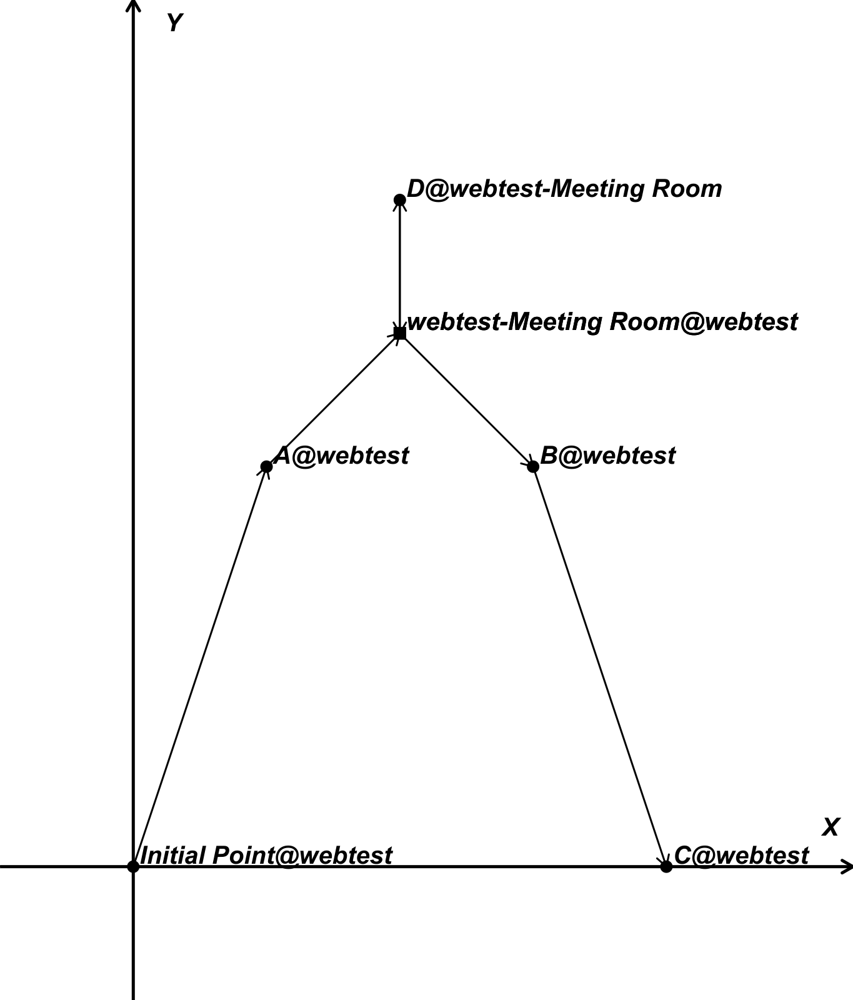

# readygo (archive)
*This repo is an archive for Ready GO Project 2019 (ANZ summer intern prerequisites)*

**Golang 学习笔记：请参见[ Golang 学习笔记](./go-note.md)**

## REST API 文档
- (**Recommended**): 前往[**Swagger UI**](https://api.readygo.miosolo.top:8043/apidocs/?url=https://api.readygo.miosolo.top:8043/v1/apidocs.json)页面查看交互式文档并进行功能验证
- 查看[**自动生成JSON文档**](https://api.readygo.miosolo.top:8043/v1/apidocs.json)

## 数据结构说明
- **io.Checkpoint**: 表示空间中的一个可达检查点，可能是资产或是空间切换点（如门）
  - Name: 所在空间内的唯一标识符
  - Base: 基础空间的Name，标识了该点所属的母空间
  - Rx: 相对于基础空间基点的相对坐标x
  - Ry: 相对坐标y
  - IsPortal: 是否是空间切换点；若是，则weight无效
  - Weight: 抽样权重，默认为1，可以为任意正数
- **net.Asset**: 表示空间中的实际资产坐标点，**由Name和Base唯一确定**。详见[Swagger UI - net.Asset](https://api.readygo.miosolo.top:8043/apidocs/?url=https://api.readygo.miosolo.top:8043/v1/apidocs.json#model-net.Asset)
- net.Asset: 表示一个逻辑上的空间，具有唯一的母空间和数个子空间，并有一个空间的进入和退出点（如门），**由Name唯一确定**。*进行这样的设计是考虑到办公室的空间多为具有一个出/入口的封闭空间，这样可以避免“穿墙”的错误选路，并且可以将选路问题层次化、局部化、并行化，节省计算时间*。详见[Swagger UI - net.Asset](https://api.readygo.miosolo.top:8043/apidocs/?url=https://api.readygo.miosolo.top:8043/v1/apidocs.json#model-net.Asset)

## 包结构和功能说明（基于当前分支）
- io: 
  - csv.go: 读取csv相关函数
  - structs.go: 定义文件IO的结构Checkpoint，统一标识Asset/ baseSpace
- net:
  - convert.go: 在net包的Asset/ Space结构与io包的Checkpoint结构之间进行转换
  - database.go: 定义了后端与MongoDB服务器和Redis服务器通信的机制，实现了使用的CRUD操作
  - restful.go: 实现了REST API层的功能和WebServer的定义，并使用[go-restful-openapi](https://github.com/emicklei/go-restful-openapi)实现了文档自动生成
  - route.go: 接收REST层的路径规划请求，对每个子空间并行化调用route包的TSP路径规划，并实现了对路径规划结果的序列化和缓存
  - sample.go: 使用[**Algorithm A** by Pavlos S. Efraimidis et al.](https://www.researchgate.net/publication/47860855_Weighted_Random_Sampling_over_Data_Streams)，对[]Asset根据其权重进行抽样
  - structs.go: 定义了本包的Asset和Space结构，并预先定义了测试与生产两个默认环境配置
- route:
  - pic.go: 接收REST层的绘图调用并对最优路径进行图片输出
  - tsp.go: 利用动态规划求解一个子空间内部的最优路径
- test:
  - test.crt: 测试用自签名证书
  - test.key: 测试用服务器私钥
- vendor: 依赖包
- main.go: 定义了命令行参数并设置服务参数，启动REST和Swagger UI服务

## 测试方式
- 单元测试:
  ```shell
  go test ./...
  ```
- 系统测试：
  ```shell
  go build && ./readygo -h
  
  Usage of ./readygo:
  -crt string
        server certificate file
  -demo
        web demo mode will use the self-signed certficates and load test data
  -key string
        server private key file
  -mongodb string
        mongoDB Database name
  -mongouri string
        mongoDB server URI
  -redispass string
        Redis auth password
  -redisurl string
        Redis server URL
  -sample
        sample mode will load the test data
  ```

## 样例
使用 **--sample true** 参数启用以下样例数据

点击[请求链接](https://api.readygo.miosolo.top:8043/v1/route/space/webtest?sample-rate=1.0&init-x=0&init-y=0)获取规划结果
### 样例空间
| 名称               | 母空间 | 相对位置X | 相对位置Y |
| -------------------- | ------- | --------- | --------- |
| webtest              |         | 0         | 0         |
| webtest-Meeting Room | webtest | 2         | 4         |
### 样例资产
| 名称 | 母空间            | 相对位置X | 相对位置Y | 抽样权重 |
| ---- | -------------------- | --------- | --------- | -------- |
| A    | webtest              | 1         | 3         | 1        |
| B    | webtest              | 3         | 3         | 1        |
| C    | webtest              | 4         | 0         | 1        |
| D    | webtest-Meeting Room | 0         | 1         | 1        |
### 运行结果


### 更多样例
请使用[**Swagger UI**](https://api.readygo.miosolo.top:8043/apidocs/?url=https://api.readygo.miosolo.top:8043/v1/apidocs.json)页面或导入[Postman Collection](./test/api.readygo.miosolo.top-test.postman_collection.json)

### 网页授权
本服务使用了**HTTPS + HTTP Basic Authentication**，测试用户名为*readygo-test*，密码为*readygo2019*
